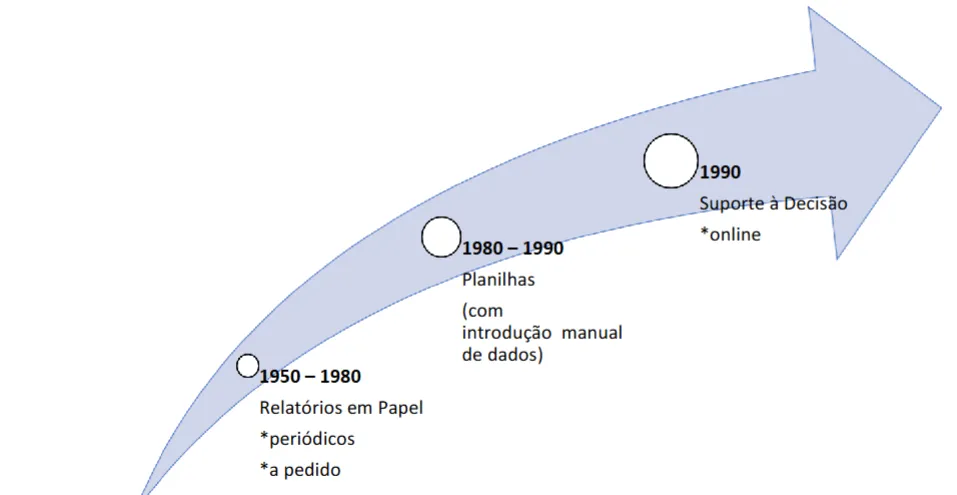
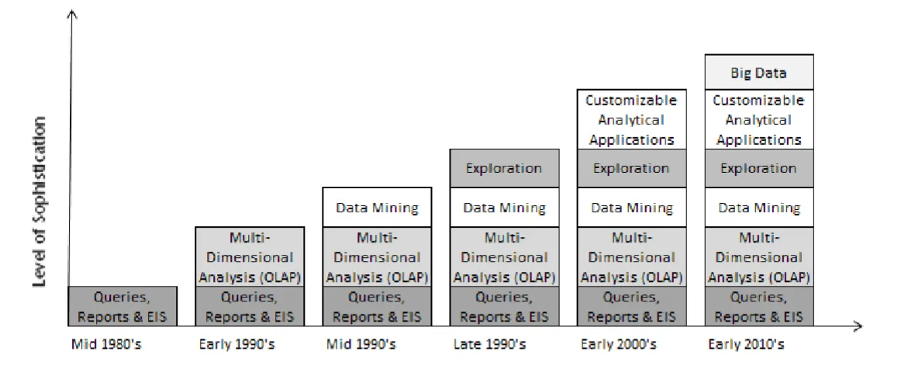

## O que é SSD? 

> *“Um sistema de informação interativo, flexível e adaptável, especialmente
> desenvolvido para apoiar a solução de um problema gerencial não estruturado,
> com o objetivo de aperfeiçoar a tomada de decisão. Utiliza dados, provê uma
> interface amigável e permite ao tomador de decisão construir sua própria
> percepção.”*  
>
> — **Barbieri (2001)**  
> [Fonte: Revista BJIS](https://revistas.marilia.unesp.br/index.php/bjis/article/view/5962/4525)

Um **Sistema de Suporte à Decisão (SSD)** é um sistema que proporciona
aos seus usuários não apenas um acesso rápido à informação, mas também
a capacidade de realizar análises e formatar os resultados de acordo com
as suas necessidades.

---
## Evolução

## Histórico

## Modelos

### Modelo estático
- Estabelece relacionamentos.  
  - Ex.: vender determinado produto a partir de uma idade, renda ou outro dado do consumidor.  

### Modelo de previsão
- A plataforma é alimentada com dados históricos.  
  - Ex.: prever vendas futuras e até mesmo antecipar o que a concorrência pode fazer.  

### Modelo de otimização
- Ajuda a determinar quando alocar recursos para variáveis específicas.  
  - Ex.: definir o momento ideal para repor um estoque e evitar a indisponibilidade de um item.  

### Modelo de análise de sensibilidade
- Responde a perguntas do tipo “e se...” para determinar as consequências de diferentes decisões.  
  - Ex.: *“O que pode acontecer se eu aumentar o preço do produto X em 5%?”*  
