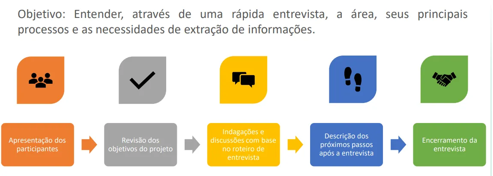

Como dever ser uma arquitetura de projeto usando o OLAP.

## Arquitetura de um projeto de PowerBI

## Cubo

### O que é um Cubo OLAP?

Um **cubo OLAP** é uma estrutura de dados usada para organizar informações em **múltiplas dimensões** (como tempo, região, produto, cliente, etc.), permitindo **análises rápidas, interativas e flexíveis**.

 | A ideia é que você possa olhar os dados de diferentes “ângulos” — assim como gira um cubo físico.

Um cubo é criado tendo-se em mente o tipo de consulta que um gerente de projeto pode querer fazer. Ao projetar um cubo é importante levar em conta as prováveis consultas que poderão ser feitas no cubo, porém não se deve perder de vista que existem muitas consultas potenciais que podem surgir. Portanto, o projeto de um cubo deve priorizar a escolha e a organização das dimensões que podem influenciar nas medidas relacionadas à decisão que o usuário deve tomar. A escolha das dimensões é fundamental no projeto de um cubo.

### Arquitetura OLAP

## 3. Tipos de OLAP

O “tipo” de OLAP depende de **como e onde** os dados ficam armazenados para análise:

### **MOLAP** (*Multidimensional OLAP*)

- Armazena os dados em **cubos multidimensionais** pré-calculados.
- Muito rápido para consultas, mas pode ser caro e menos escalável para grandes volumes.
- Exemplo: Microsoft Analysis Services (modo multidimensional), Oracle Essbase.

### **ROLAP** (*Relational OLAP*)

- Usa **bancos relacionais** (como BigQuery, Snowflake) para calcular os resultados na hora.
- Mais flexível e escalável, mas pode ser mais lento.
- Exemplo: Tableau conectando direto ao BigQuery.

### **HOLAP** (*Hybrid OLAP*)

- Combina MOLAP e ROLAP: agregados rápidos no cubo e detalhes no banco relacional.
- Boa performance e flexibilidade.
- Exemplo: Analysis Services no modo híbrido.

### **DOLAP** (*Desktop OLAP*)

- Cubos armazenados no computador do usuário, permitindo análise offline.
- Muito usado no passado, hoje quase abandonado.

## 4. Exemplos reais

| Tipo | Onde aparece hoje | Exemplo |
| --- | --- | --- |
| MOLAP | Cubos pré-processados | SAP BW, Oracle Essbase |
| ROLAP | Consulta em DW | Tableau, Looker, Qlik conectados direto ao BigQuery |
| HOLAP | Híbrido | Microsoft SSAS modo híbrido |
| DOLAP | Local/offline | Excel Pivot com cache local (antigo) |

---

## 1. O que é navegação multidimensional?

Quando temos dados organizados em **dimensões** (ex.: Tempo, Local, Produto) e **medidas** (ex.: Vendas, Quantidade), podemos navegar nesses dados mudando o nível de detalhe ou mudando de perspectiva.

Essa navegação é chamada de **operações OLAP** e ajuda o usuário a **explorar** os dados.

## 2. Tipos de navegação (o que a tabela mostra)

### Tipos De Drill

### **a) Drill Down (Down)**

- **O que é:** Aumenta o nível de detalhe (mais granularidade).
- **O que acontece:** Você desce na hierarquia da dimensão.
- **Exemplo:** Estado → Cidade → Bairro.
- **Impacto:** Mais dados para processar, consultas podem ficar mais pesadas.
- **No Power BI:** Clicar no botão de “Drill Down” ou no “+” da hierarquia.

### **b) Drill Up (Up)**

- **O que é:** Reduz o nível de detalhe (menos granularidade).
- **O que acontece:** Você sobe na hierarquia da dimensão.
- **Exemplo:** Cidade → Estado → Região.
- **Impacto:** Menos dados, visão mais resumida.
- **No Power BI:** Botão “Drill Up” ou “-” na hierarquia.

### **c) Drill Across (Across)**

- **O que é:** Pula níveis intermediários dentro da **mesma dimensão**.
- **O que acontece:** Você não segue a ordem direta da hierarquia.
- **Exemplo:** Cidade → País (pulando Estado).
- **No Power BI:** Alterar diretamente o nível exibido no campo de dimensão.

### **d) Drill Through (Through)**

*(No seu quadro está escrito “Throught”, mas o termo correto é “Through”)*

- **O que é:** Sai de uma dimensão e vai para outra, levando o contexto.
- **O que acontece:** Você troca o eixo de análise.
- **Exemplo:** Começa vendo Vendas por Ano, depois muda para Vendas por Estado mantendo o filtro do ano.
- **No Power BI:** Função “Drill Through” no menu, que cria páginas de relatório de detalhe.

## 3. Como isso se relaciona com OLAP

Essas operações são **ações típicas em cubos OLAP**, porque:

- O cubo guarda as dimensões hierárquicas.
- O motor OLAP calcula agregações para cada nível.
- O usuário pode navegar livremente sem reprocessar todo o banco.

No **Power BI**, mesmo que não esteja usando um “cubo OLAP” clássico, a engine interna (VertiPaq ou conexão live com Analysis Services) faz o papel do OLAP e permite essas navegações.

---

##  Ciclo de Vida Projeto Dados 

---
## Entrevista com usuário chave

Faça uma ata para ficar claro o entendimento e deixar registrado o que ficou acordado na reunião.

Este é um projeto que definimos com o usuário. 

---

# Observação:

## Diferença entre Data Lake vs Data Warehouse

Eles se completam:

### **1. Data Lake – Camada Bruta (Raw Layer)**

- **Objetivo:** Receber *todos* os dados no estado original.
- **Fontes:** Bancos transacionais, APIs, sensores IoT, arquivos, logs, redes sociais, etc.
- **Vantagens:**
    - Mantém um “backup” histórico fiel.
    - Permite reprocessar dados se houver mudanças na lógica de tratamento.
    - Aceita dados estruturados, semiestruturados e não estruturados.

### **2. Data Lake – Camadas de Processamento**

Muitas empresas quebram o Data Lake em três camadas:

1. **Raw** (bruto) – cópia exata da fonte.
2. **Cleansed** (limpo) – dados padronizados, tipagem corrigida, remoção de duplicidades.
3. **Curated/Trusted** (curado) – dados prontos para consumo ou integração com o DW.

### **3. Data Warehouse – Dados Tratados**

- **Objetivo:** Consolidar apenas dados relevantes para análises e relatórios.
- **Processo:** ETL ou ELT transforma dados do *Curated Layer* do Data Lake para o DW.
- **Benefícios:**
    - Alta performance em consultas.
    - Dados padronizados, governados e de confiança.
    - Integração direta com ferramentas de BI como Power BI, Tableau, Looker.