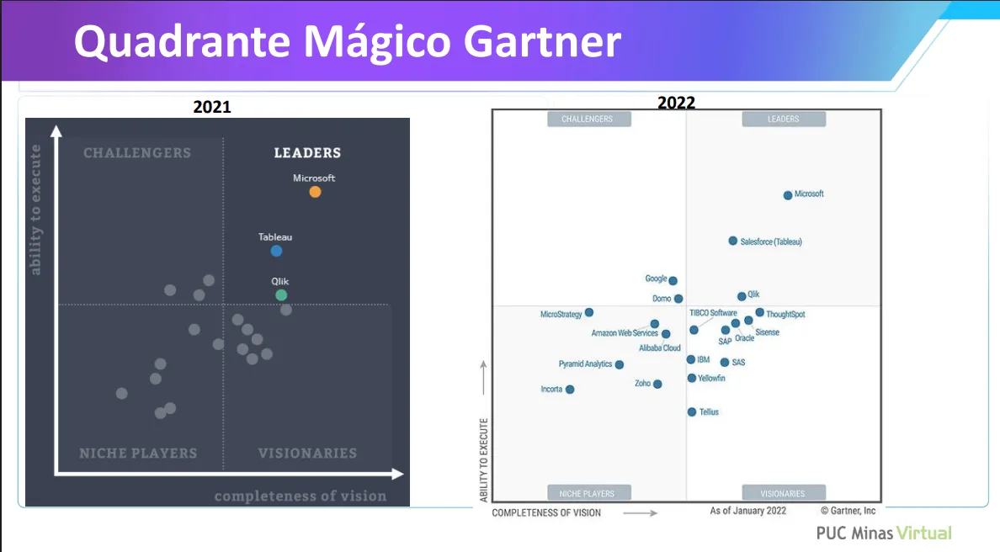

# Aula 3 - Ferramentas OLAP

O **Gartner Group**, fundado na década de 1970, é uma empresa norte-americana de renome internacional especializada em pesquisas e consultorias na área de tecnologia da informação. Executivos e líderes de organizações no mundo inteiro acompanham de perto suas análises, pois elas influenciam diretamente decisões estratégicas sobre investimentos e adoção de tecnologias.

Entre seus estudos mais conhecidos está o **Magic Quadrant** (*Quadrante Mágico*), que classifica fornecedores de tecnologia com base em dois eixos principais:

- **Capacidade de execução** (*Ability to Execute*)
- **Abrangência da visão** (*Completeness of Vision*)

Essa classificação é dividida em quatro quadrantes:

- **Leaders (Líderes):** empresas com alta capacidade de execução e visão abrangente.
- **Challengers (Desafiadores):** boa execução, mas visão menos completa.
- **Visionaries (Visionários):** visão inovadora, mas ainda com lacunas na execução.
- **Niche Players (Participantes de Nicho):** foco em segmentos específicos, com presença limitada.

Nos últimos dois anos, considerando que esta aula foi gravada em 2023, três ferramentas mantiveram-se entre as **líderes** em soluções OLAP e BI, segundo o Gartner:

- **Microsoft (Power BI)**
- **Salesforce (Tableau)**
- **Qlik**

O gráfico a seguir apresenta o posicionamento das principais ferramentas no **Quadrante Mágico Gartner** para os anos de 2021 e 2022, evidenciando a consistência dessas três plataformas na liderança do mercado.

---

### **SAP – Visão Geral**

O **SAP** é um dos maiores fornecedores globais de soluções corporativas de gestão e análise de dados, com atuação que remonta aos anos 1970. Ao longo das décadas, construiu um ecossistema robusto de aplicações ERP, gestão de processos e plataformas de *Business Intelligence*, tornando-se referência para empresas de grande porte e operações complexas.

No contexto de **BI e OLAP**, a SAP ganhou destaque principalmente com o **SAP BW (Business Warehouse)**, lançado nos anos 1990, que foi um dos pilares do BI corporativo tradicional. O BW armazenava dados consolidados de diferentes módulos do ERP e de sistemas externos, permitindo análises avançadas por meio de:

- **Cubos OLAP multidimensionais**.
- Modelagem hierárquica de dimensões e medidas.
- Relatórios gerenciados e governados pela TI.

Com a evolução tecnológica e a necessidade de análises em tempo real, a SAP lançou o **SAP HANA**, uma plataforma *in-memory* que revolucionou a velocidade de processamento e a flexibilidade das análises. Essa mudança trouxe:

- Consultas analíticas em grandes volumes de dados com latência muito baixa.
- Integração de OLAP e OLTP em uma única base (*translytical*).
- Capacidade de consumir dados de *data lakes* e *cloud* junto aos dados corporativos.

Além disso, a SAP desenvolveu o **SAP Analytics Cloud (SAC)**, que agrega:

- Criação de dashboards e relatórios interativos.
- Análises preditivas com recursos de IA.
- Planejamento e simulação de cenários.

Hoje, a SAP combina sua herança de **BI tradicional** (com forte governança e integração corporativa) com recursos modernos de análise em nuvem, mantendo-se como uma “baita ferramenta de mercado” para organizações que demandam confiabilidade, segurança e integração profunda com processos de negócio.

### Oracle Business Intelligence – Visão Geral

A **Oracle** é uma das gigantes globais em tecnologia da informação, conhecida principalmente por seus bancos de dados, mas que também possui um portfólio robusto de soluções de *Business Intelligence* e análise de dados.

O **Oracle Business Intelligence (Oracle BI)** surgiu como uma plataforma corporativa voltada para:

- Integração de dados de múltiplas fontes.
- Criação de relatórios e dashboards.
- Análises OLAP e ad-hoc.
- Distribuição de informações de forma segura e governada.

Nos anos 2000, com a aquisição da Siebel Systems, a Oracle incorporou o **Siebel Analytics**, que foi a base para o **Oracle BI Enterprise Edition (OBIEE)** — um dos produtos mais utilizados no mercado corporativo tradicional de BI. Ele oferecia:

- Modelo de metadados centralizado (*Semantic Layer*).
- Suporte a cubos OLAP e bancos relacionais (*ROLAP* e *MOLAP*).
- Dashboards interativos e relatórios gerenciados.

Com a transição para a nuvem, a Oracle evoluiu para o **Oracle Analytics Cloud (OAC)**, que combina o legado do OBIEE com recursos modernos:

- Visualização de dados mais intuitiva.
- Recursos de IA e *machine learning* integrados.
- Análises preditivas e *self-service BI*.
- Integração direta com Oracle Autonomous Data Warehouse e outros serviços em nuvem.

Hoje, a Oracle BI atende desde empresas que mantêm ambientes **on-premises** (com OBIEE) até organizações que migraram para a nuvem com **OAC**, oferecendo um ecossistema completo de análise de dados, do OLAP tradicional a insights avançados com inteligência artificial.

---

### **Pentaho – Visão Geral**

O **Pentaho** é uma plataforma de *Business Intelligence* e análise de dados **open source** que ganhou destaque nos anos 2000 como alternativa flexível e de menor custo em relação às soluções proprietárias tradicionais. Originalmente desenvolvido pela Pentaho Corporation, foi posteriormente adquirido pela **Hitachi Data Systems**, passando a integrar o portfólio da **Hitachi Vantara**.

A proposta central do Pentaho sempre foi oferecer um ecossistema completo para todo o ciclo de dados, incluindo:

- **ETL e integração de dados** (*Pentaho Data Integration – PDI/Kettle*).
- **Análises OLAP** (via Mondrian OLAP Engine).
- **Dashboards e relatórios interativos**.
- **Minerção de dados e integração com machine learning**.

No contexto OLAP, o Pentaho se diferencia por:

- Uso de **Mondrian**, um motor OLAP open source que suporta consultas MDX e modelagem multidimensional.
- Flexibilidade para conectar-se a múltiplas fontes (bancos relacionais, NoSQL, arquivos e *data lakes*).
- Compatibilidade com diferentes modelos de dados (MOLAP e ROLAP).

Entre as principais vantagens do Pentaho estão:

- **Custo reduzido** em relação a plataformas proprietárias.
- Forte **comunidade open source** e documentação acessível.
- Alta flexibilidade para customizações.

Com a evolução para a nuvem e integração com big data, o Pentaho passou a oferecer conectividade com Hadoop, Spark e outras tecnologias modernas, mantendo-se relevante em cenários que exigem **baixo custo, alta flexibilidade e controle total sobre a arquitetura**.

---

### Qlik – Visão Geral

A **Qlik** é uma plataforma de *Business Intelligence* e análise de dados reconhecida por seu **modelo associativo** único, que permite aos usuários explorar livremente conexões entre dados sem ficarem restritos a consultas pré-definidas. Fundada nos anos 1990 na Suécia, tornou-se referência global com suas soluções **QlikView** e, mais recentemente, **Qlik Sense**.

**Evolução das soluções:**

- **QlikView (1990s–2010s):** primeira geração da plataforma, com foco em dashboards e análises rápidas, baseada em um motor **in-memory** que carregava e processava grandes volumes de dados localmente.
- **Qlik Sense (2014–presente):** versão mais moderna, com arquitetura em nuvem e interface responsiva, que amplia o conceito associativo, adiciona recursos de *self-service BI* e maior governança corporativa.

**Diferenciais da Qlik:**

- **Motor Associativo Qlik:** diferente de OLAP tradicional (que segue hierarquias fixas), o modelo associativo permite que o usuário navegue livremente entre dimensões e encontre relações não previstas.
- **Alta performance in-memory:** dados carregados na memória para consultas rápidas.
- **Integração híbrida:** conecta-se a dados locais, na nuvem e *big data*.
- **Visualizações dinâmicas:** gráficos interativos, mapas geoespaciais e dashboards responsivos.
- **Governança:** controle de segurança e gerenciamento centralizado para ambientes corporativos.

**Recursos OLAP no Qlik:**

- Suporte a análises multidimensionais (ROLAP e abordagem híbrida com in-memory).
- Capacidade de detalhar (*drill-down*) e consolidar (*roll-up*) dados em tempo real.
- Integração com modelos de dados complexos sem necessidade de cubos físicos.

O Qlik é amplamente utilizado por empresas que buscam **flexibilidade de exploração de dados** combinada com **governança centralizada**, sendo competitivo tanto com líderes como Microsoft Power BI e Tableau quanto em nichos de análises mais exploratórias.

 o **Qlik**, especialmente o **QlikView** e o **Qlik Sense** no modo *in-memory*, tende a consumir mais memória RAM do que ferramentas OLAP tradicionais que operam diretamente sobre bancos relacionais (**ROLAP**).

Isso acontece porque:

1. **Armazenamento completo na memória**
    - O Qlik carrega os dados para a RAM durante a abertura do aplicativo/dashboards.
    - Uma vez na memória, as consultas são extremamente rápidas, mas isso exige **quantidade suficiente de RAM** para suportar o volume de dados carregados.
2. **Modelo Associativo**
    - Diferente de cubos OLAP fixos (MOLAP), o motor associativo mantém várias relações e índices entre tabelas para permitir navegação livre — e isso também ocupa memória extra.
3. **Dados desnormalizados**
    - Muitas implementações no Qlik usam modelos de dados mais “achatados” (*denormalizados*) para ganhar performance, o que aumenta o tamanho em memória.

---

### Tableau – Visão Geral

O **Tableau** é uma das plataformas de *Business Intelligence* e visualização de dados mais conhecidas no mundo, criada em 2003 e adquirida pela **Salesforce** em 2019. É amplamente reconhecido pela sua capacidade de criar visualizações ricas e interativas de forma intuitiva, permitindo que usuários de negócio explorem dados com pouca dependência da área de TI.

**Diferenciais do Tableau:**

- **Foco em visualização:** interface arrastar e soltar para criar gráficos, mapas, dashboards e *storytelling* de dados.
- **Conexão com múltiplas fontes:** suporta bancos relacionais, cubos OLAP, *cloud data warehouses* (BigQuery, Snowflake, Redshift) e arquivos locais (Excel, CSV, etc.).
- **Análises interativas:** recursos de *drill-down*, filtros dinâmicos e parâmetros para exploração ad-hoc.
- **Alta integração com OLAP:** pode trabalhar tanto no modo **ROLAP** (consulta direta ao banco) quanto no modo **extrato in-memory** (*Hyper Engine*), que melhora a performance.
- **Comunidade e ecossistema:** forte comunidade de usuários, repositório de dashboards prontos (*Tableau Public*), treinamentos e extensões.

**Uso no contexto OLAP:**

- Em **ROLAP**, o Tableau se conecta diretamente ao *data warehouse* ou cubos OLAP (ex.: Microsoft Analysis Services) e processa as consultas no servidor.
- Em **MOLAP** ou modo extrato, carrega dados para o motor *in-memory*, melhorando a velocidade de análise, mas exigindo mais memória local ou do servidor Tableau.

**Pontos fortes:**

- Facilidade de uso e criação rápida de visualizações.
- Recursos avançados de design e interatividade.
- Boa integração com Salesforce e ecossistemas corporativos.

**Pontos de atenção:**

- Alto custo de licenciamento para grandes equipes.
- Necessidade de boas práticas de modelagem para manter performance com grandes volumes de dados.

O Tableau é indicado para organizações que buscam **impacto visual, exploração flexível e integração com múltiplas fontes de dados**, sem abrir mão da capacidade de se conectar a arquiteturas OLAP corporativas.

---

### PowerBI - Visão Geral

O **Power BI**, desenvolvido pela **Microsoft**, é uma das plataformas de *Business Intelligence* mais populares e utilizadas atualmente, ocupando consistentemente posição de liderança no **Gartner Magic Quadrant** para plataformas de análise e visualização de dados. Lançado em 2015 como evolução do *Power Pivot* e *Power Query* (componentes do Excel), o Power BI rapidamente se consolidou como referência no mercado graças à sua integração com o ecossistema Microsoft e ao custo competitivo.

**Principais características e diferenciais:**

- **Integração nativa com o Microsoft 365 e Azure:** fácil conexão com Excel, Teams, SharePoint, SQL Server, Azure Synapse, entre outros.
- **Modo de dados híbrido:** pode operar em modo **importação in-memory** (para alta performance) ou **DirectQuery** (ROLAP, consultando diretamente a fonte).
- **Power Query e DAX:** linguagem de transformação de dados (M/Power Query) e linguagem analítica (DAX) para criação de métricas e cálculos complexos.
- **Visualizações interativas:** grande biblioteca de gráficos e mapas, com possibilidade de adicionar visuais personalizados (*custom visuals*).
- **Publicação e compartilhamento:** dashboards podem ser publicados no **Power BI Service** (nuvem) ou **Power BI Report Server** (on-premises).
- **IA integrada:** recursos como análise de sentimentos, previsão de tendências e *Q&A* (consultas em linguagem natural).

**Uso no contexto OLAP:**

- **ROLAP:** no modo *DirectQuery*, executa consultas diretamente sobre *data warehouses* e bancos OLAP, como SQL Server Analysis Services (SSAS) ou Azure Analysis Services.
- **MOLAP:** quando utilizado com cubos SSAS no modo multidimensional, aproveita agregações e cálculos pré-processados.
- **Import/In-Memory:** carrega dados para o mecanismo VertiPaq, otimizando consultas com compressão de memória e índices.

**Pontos fortes:**

- Interface amigável e fácil curva de aprendizado.
- Grande comunidade e ecossistema de parceiros.
- Preço competitivo comparado a concorrentes como Tableau e Qlik.

**Pontos de atenção:**

- Pode enfrentar limitações de performance em conjuntos de dados muito grandes no modo in-memory sem otimização.
- Algumas funcionalidades avançadas dependem de licenças premium.

O Power BI é indicado para organizações de todos os portes que buscam **velocidade de implementação, integração com Microsoft e escalabilidade**, equilibrando governança corporativa e *self-service BI*.