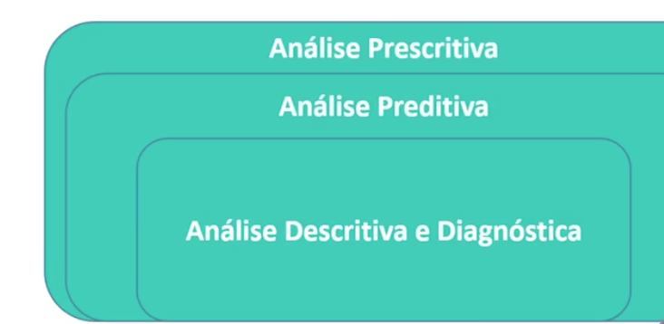
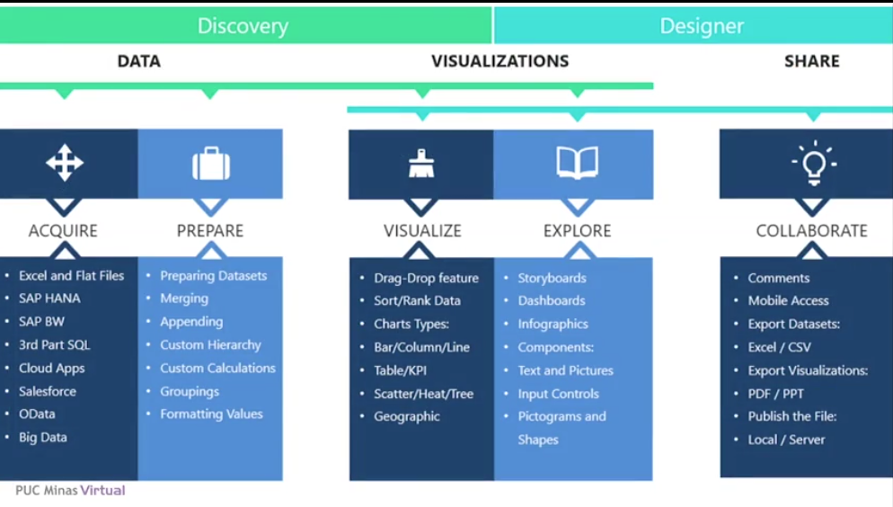
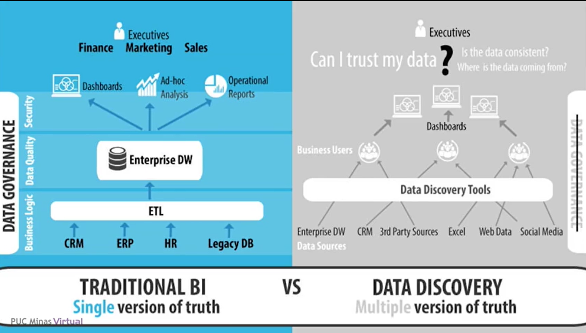

# Conceitos e Aplicações de Data Discovery

## O que é Data Discovery e Analytics?
É o processo de **explorar, organizar e interpretar dados** (estruturados e não estruturados) de forma **intuitiva e acessível**, permitindo que profissionais de diferentes áreas — e não apenas especialistas em TI — consigam **formular perguntas de negócio** e obter **respostas rápidas** por meio de análises visuais e interativas.  

- Permite que os usuários desenvolvam e refinem visualizações e análises de dados estruturados e não estruturados utilizando termos de pesquisa.  

- Possibilita que as áreas de negócio utilizem dados relevantes em modo *self-service*, em qualquer lugar. A ferramenta oferece ao usuário flexibilidade na composição e utilização das informações, acessíveis em tablets e smartphones, sem a necessidade de relatórios pré-definidos e estáticos, que geralmente demandam muito tempo para serem desenvolvidos e criam alta dependência do setor de TI.  

- Sem a necessidade de relatórios fixos, como no modelo tradicional, é possível levar análises de informação para todos os setores e níveis da organização.  

### Objetivo Principal

- Dar **autonomia** às áreas de negócio.  
- Permitir **descobertas rápidas** que embasem decisões.  
- Reduzir a **dependência da TI** e o tempo de espera por relatórios.  
- Incentivar a **cultura de dados** em toda a organização.  

---

## Etapas do Data Discovery

1. **Visualização dos dados** – transformar informações em gráficos, tabelas e dashboards.  
2. **Descoberta de informações** – identificar padrões, tendências e correlações escondidas nos dados.  
3. **Influência nos negócios** – quando a análise gera decisões práticas.  
4. **Análise preditiva** – antecipar cenários futuros para apoiar o planejamento estratégico.  

> **Exemplo aplicado (Varejo):**  
Uma rede de supermercados pode usar Data Discovery para identificar **mudanças no comportamento de compra** dos clientes. Assim, consegue planejar **promoções direcionadas** (marketing mais assertivo), aumentando vendas e reduzindo desperdício de estoque.

---

## Tipos de Análises em Data Discovery

### Análise Descritiva e Diagnóstica
- **Perguntas típicas:** *O que aconteceu?* e *Por que aconteceu?*  
- **Exemplo:** identificar que as vendas caíram 10% em agosto e descobrir que isso ocorreu devido à falta de estoque em determinados produtos.  
- Objetivo: entender o passado e encontrar a **causa raiz dos problemas**.  

--

- Monitorar e interpretar KPIs por meio de dados históricos.  
- Normalmente, a pergunta é ***O que?***  
  - Auxilia na compreensão do motivo pelo qual a empresa se encontra em determinada situação.  
- Permite investigar os dados para detectar a causa raiz dos problemas.  
- Normalmente, a pergunta é ***Por quê?***  

### Análise Preditiva

- **Pergunta típica:** *O que vai acontecer?*  
- Baseia-se em dados históricos e técnicas estatísticas ou de machine learning para **prever tendências futuras**.  
- **Exemplo:** prever aumento na demanda de guarda-chuvas em épocas chuvosas.  
- Benefício: permite que a empresa **se antecipe** às necessidades do mercado.  

--

- Utiliza dados históricos para prever eventos futuros.  
- Normalmente, a pergunta é ***O que vai acontecer?***  

A avaliação preditiva consiste em tomar como referência dados do passado e do presente para formular prognósticos. Esse tipo de análise responde tanto a questões já conhecidas quanto a pontos ainda não identificados. Ao adotar essa abordagem, a empresa consegue enxergar mais longe, valendo-se de recursos e técnicas específicas.  

### Análise Prescritiva

- **Pergunta típica:** *O que devo fazer?*  
- Indica **ações recomendadas** com base em simulações e cenários futuros.  
- **Exemplo:** sugerir ajuste de preços, campanhas promocionais ou reforço no estoque para evitar perda de vendas.  
- Benefício: orienta a **tomada de decisão proativa**.  

--

- Normalmente, a pergunta é ***O que devo fazer?***  
- Fornece recomendações de ações a serem tomadas.  

---

## Business Intelligence Tradicional vs Data Discovery

| Aspecto | BI Tradicional | Data Discovery |
|---------|----------------|----------------|
| **Estrutura** | Dados centralizados em um Data Warehouse após ETL | Acesso direto a diversas fontes (DW, CRM, Excel, Social Media, Web Data) |
| **Governança** | Forte (segurança, consistência, padronização) | Mais fraca (risco de inconsistências) |
| **Velocidade** | Mais lento (depende da TI) | Ágil e flexível (self-service) |
| **Controle** | Uma versão única da verdade (*Single Version of Truth*) | Várias versões possíveis (*Multiple Versions of Truth*) |
| **Exemplo de uso** | Relatório financeiro consolidado para diretoria | Marketing criando rapidamente análise de perfil de clientes |

#### Diferença em relação ao modelo tradicional:
- **Antes (BI Tradicional):** os usuários dependiam da TI para gerar relatórios fixos e demorados.  
- **Agora (Data Discovery):** cada área pode **criar suas próprias análises**, sem esperar relatórios pré-definidos.  

> **Analogia simples:**  
No modelo tradicional, você precisava esperar alguém cozinhar e trazer o prato pronto (relatório).  
No Data Discovery, você tem acesso direto aos ingredientes (dados) e às ferramentas de cozinha (dashboards), podendo montar seu prato na hora.

### Business Intelligence (BI) Tradicional

**Estrutura:**  

- Dados de diferentes fontes (CRM, ERP, RH, sistemas legados) passam por um processo de **ETL** (Extrair, Transformar, Carregar).  
- Esses dados são centralizados em um **Data Warehouse corporativo (Enterprise DW)**.  
- A partir dele, são criados **dashboards, relatórios operacionais e análises ad-hoc**.  

**Características:**  

- Governança forte: regras de negócio, segurança, qualidade e consistência de dados.  
- Uma versão única da verdade (*Single Version of Truth*): todos os usuários acessam dados consistentes, padronizados e validados.  
- Mais controle, mas menos flexibilidade: usuários dependem da área de TI/BI para criar relatórios ou incluir novas fontes de dados.  

> É seguro e confiável, mas pode ser lento e engessado.  

### Data Discovery

**Estrutura:**  

- Usuários de negócio acessam diretamente diversas fontes (DW, CRM, Excel, Web Data, Redes Sociais etc.).  
- Utilizam ferramentas de descoberta de dados (*Data Discovery Tools*) para criar dashboards rapidamente.  

**Características:**  

- Mais agilidade e autonomia: usuários podem combinar diferentes fontes sem depender da TI.  
- Várias versões da verdade (*Multiple Versions of Truth*): como cada usuário manipula os dados de forma independente, há risco de inconsistências.  
- Governança mais fraca: dificuldade em garantir segurança, qualidade e padronização dos dados.  

> É rápido e flexível, mas pode gerar confusão sobre qual dado é o correto.  

---

## Vantagens do Data Discovery

- **Democratização dos dados:** qualquer usuário pode explorar e analisar informações.  
- **Velocidade na geração de insights:** testar hipóteses e validar ideias em pouco tempo.  
- **Ferramentas intuitivas:** dashboards interativos e de fácil navegação.  
- **Entrega automatizada:** informações críticas chegam de forma ágil.  
- **Integração social:** promove colaboração entre diferentes áreas da organização.  
- **Cultura analítica:** incentiva decisões baseadas em evidências e não em achismos.  

---

### Recomendação da Gartner

> *“O ideal é utilizar Business Intelligence (BI) e Data Discovery de forma **complementar**.”*  

- O **BI** garante **segurança, consistência e padronização**.  
- O **Data Discovery** oferece **velocidade, flexibilidade e inovação**.  

---

## Estudo de Caso Didático

**Cenário:**  
Uma empresa de telefonia deseja reduzir o índice de **churn** (cancelamento de clientes).  

**Passo a passo com Data Discovery:**  
1. **Coleta de dados:** histórico de clientes, tempo de contrato, reclamações registradas, perfil de consumo, uso de serviços e pagamento de faturas.  
2. **Visualização inicial:** identificar clientes que cancelaram nos últimos 12 meses.  
3. **Descoberta de padrões:** observar que clientes com muitas reclamações e faturas em atraso cancelam mais rapidamente.  
4. **Análise preditiva:** prever quais clientes têm maior probabilidade de cancelar nos próximos meses.  
5. **Análise prescritiva:** recomendar ações como oferecer desconto, melhorar o atendimento ou criar planos personalizados para clientes em risco.  

**Resultado esperado:**  
- Redução no índice de cancelamento.  
- Melhoria na retenção de clientes.  
- Economia em custos de aquisição de novos clientes.  

---
