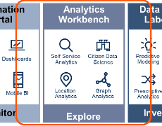

# O que é Self Service Analytics

Permitir que as análises de indicadores e manipulações de informações não fique restrita a um pequeno grupo de especialistas. Ao contrário, o que se deseja é que todos sejam capazes de contribuir como "Analistas de dados". 
Para isso, deve-se criar interfaces amigáveis e de fácil usabilidade para os relatórios de acompanhamento por Analytics. 

#### Self-Service Analytics é um passo fundamental em direção a análise avançada 

#### Escada Evolutiva da Análise de Dados

A imagem abaixo mostra uma **escada evolutiva da análise de dados**:

- **Monitorar (BI Tradicional):** relatórios e dashboards.  
- **Explorar (Analytics):** análises interativas feitas por qualquer usuário.  
- **Investigar (Data Science):** modelos preditivos e prescritivos avançados.  
- **Aprender (IA):** uso prático de inteligência artificial em assistentes digitais, chatbots, visão computacional e muito mais.  

>Ou seja, começa no **“O que aconteceu”** → avança para **“Por que aconteceu”** → depois **“O que vai acontecer”** → e chega ao **“O que devo fazer / como posso automatizar”**.  

#### Analytics Workbench – Explorar os Dados

O **Analytics Workbench** representa a etapa em que os usuários passam a **explorar os dados de forma autônoma**, indo além dos relatórios tradicionais.  
Ele democratiza o acesso às análises, permitindo que profissionais de negócio, mesmo sem conhecimento técnico profundo, consigam **extrair insights valiosos**.

Self Service Analytics é uma forma de análise na qual profissional de linha de negócios são ativados e incentivados a realizar consultas e gerar insights por conta própria, com pouco ou nenhum suporte de TI.

---

### Por que o BI Tradicional frequentemente falha

A imagem ilustra o funcionamento do **Business Intelligence (BI) Tradicional**, em que os dados de diferentes sistemas, como **ERP**, **CRM** e **aplicações de negócio** são integrados em um **Data Warehouse**. Esse processo exige a atuação de especialistas técnicos, como **Engenheiro de dados** e **BI Developers**, que organizam, transformam e preparam os dados. Somente após essas etapas é que relatórios e dashboards são gerados e entregues aos usuários finais, como gestores e consumidores de informação.  

O grande problema é que esse fluxo é **centralizado e dependente da área de TI**. Cada solicitação de informação precisa seguir todo esse caminho técnico, o que faz com que a resposta ao usuário final demore **de 2 a 4 meses** para ser atendida. Quando a informação finalmente chega, muitas vezes o cenário de negócio já mudou, e o insight perde relevância.  

Além do tempo excessivo, o modelo apresenta outras limitações:  
- **Pouca autonomia dos usuários de negócio**, que dependem da TI para realizar análises básicas.  
- **Acesso restrito às fontes de dados**, já que somente os técnicos podem manipular os dados originais.  
- **Controle limitado do usuário**, que recebe relatórios estáticos e não consegue explorar os dados de forma livre.  

##### Exemplo de Cenário Prático

Imagine uma rede varejista que deseja entender **por que as vendas de um determinado produto caíram** nos últimos meses. No modelo de BI Tradicional, o gestor de negócios precisa abrir uma solicitação para a área de TI. Essa solicitação passa pelo **Engenheiro de dados**, que organiza os dados, e depois pelo **BI Developer**, que cria o relatório ou dashboard. Somente semanas ou meses depois o relatório é entregue ao gestor, revelando que a queda estava relacionada a falhas de distribuição em determinadas regiões.  

Entretanto, nesse período, a concorrência já pode ter ajustado sua estratégia, o que coloca a empresa em desvantagem competitiva. Esse cenário ilustra por que o BI Tradicional, apesar de confiável, **não atende à velocidade e à flexibilidade exigidas pelo mercado atual**.  

---

### Como estão errando com Pseudo Self-Service

A imagem mostra um cenário em que a empresa tenta adotar **Self-Service Analytics**, mas de forma incompleta ou mal estruturada, criando o chamado **Pseudo Self-Service**.  

#### O Fluxo Representado na Imagem

1. **Centralized Data Collection (Coleta Centralizada de Dados):**  
   - Os dados vêm de sistemas como ERP, CRM e aplicações de negócio.  
   - Esses dados são carregados para o **Data Warehouse**, ainda sob responsabilidade da área de TI e dos **Engenheiros de Dados**.  

2. **Business-Driven Data Collection (Coleta Direcionada pelo Negócio):**  
   - Surgem diferentes fontes paralelas, como **planilhas (spreadsheets)**, **data marts locais** e **fontes externas de dados**.  
   - Os usuários de negócio recorrem a essas fontes para complementar suas análises.  

3. **Preparação e Visualização:**  
   - Existe uma   **Preparação do dados** e  interação com as ferramentas de **BI**.  
   - Os **analistas de negocios** tentam criar seus próprios dashboards sem depender totalmente da TI, mas ainda não têm autonomia plena.  

4. **Consumo da Informação:**  
   - As pessoas que tomam decisões (**Decision Makers**) recebem dashboards que podem conter **inconsistências** devido ao excesso de fontes paralelas.  
   - Isso gera dúvidas sobre qual dado é o correto.  

#### Principais Problemas do Pseudo Self-Service (como mostra a imagem)

- **Coleta de dados lenta pelo Data Warehouse:** ainda existe uma forte dependência da TI e dos engenheiros de dados para estruturar as informações.  
- **Falta de suporte adequado aos analistas de negócio:** eles tentam se virar sozinhos, mas sem governança e ferramentas apropriadas.  
- **Painéis inconsistentes ou conflitantes:** como cada área cria sua versão de dashboards, surgem erros e perspectivas diferentes sobre a mesma realidade.  

#### Crítica do Mercado – Observação do Professor

O que temos visto na tendência do mercado é justamente esse erro do **Pseudo Self-Service**.  
Ferramentas como o **Power BI**, por exemplo, estão sendo usadas sem o devido cuidado no **armazenamento e preparo dos dados**.  

- Muitas vezes os dados **não são armazenados corretamente em disco** ou no **Data Warehouse**, sendo trazidos diretamente para a ferramenta.  
- Se no futuro houver necessidade de **atualizar ou corrigir algo**, todo o processo se torna mais complexo.  
- Usuários acabam **pegando dados de outras ferramentas** sem integrá-los ao Data Warehouse, o que compromete a confiança no processo.  
- Sem um processo de **ETL (Extração, Transformação e Carga) confiável**, a preparação dos dados pode conter erros, levando a **decisões equivocadas**.  

Em resumo: o **Pseudo Self-Service** cria uma falsa sensação de agilidade, mas, na prática, gera **falta de confiança nos dados** e aumenta o risco de **decisões erradas**.  

#### Exemplo Prático

Imagine que o setor de **marketing** e o setor de **vendas** de uma empresa tentem analisar o desempenho de uma campanha.  
- O marketing usa **planilhas locais** com dados de mídia digital.  
- O time de vendas utiliza relatórios do **CRM**.  
- Ambos constroem dashboards diferentes, cada um com uma visão distinta do mesmo problema.  

O resultado é que, ao chegar à diretoria, há **dois relatórios conflitantes**:  
- Um mostrando que a campanha foi altamente eficaz.  
- Outro sugerindo que os resultados foram abaixo do esperado.  

Sem governança e sem centralização dos dados no Data Warehouse, a empresa **perde a confiança nas análises** e corre o risco de **tomar decisões incorretas**.  

#### Conclusão

O **Pseudo Self-Service** surge quando a empresa tenta oferecer autonomia aos usuários de negócio sem estruturar corretamente:  
- Governança dos dados.  
- Suporte técnico e metodológico.  
- Armazenamento consistente em Data Warehouse.  
- Processos robustos de ETL, muitas vezes sob responsabilidade do **Engenheiro de Dados**.  

O resultado é uma ilusão de autonomia, mas que na prática gera **conflitos, erros e perda de confiança nos dados**.  

---

### Diferença em capacidades e processos entre BI tradicional e Self-Service Analytics

A imagem compara os dois modelos  **BI Tradicional** e **Self-Service Analytics**  destacando as mudanças em **pessoas, análises e dados**.  

#### 1. Pessoas (People)

- **BI Tradicional:**  
  O processo é centrado em profissionais técnicos como **Engenheiros de Dados (Data Engineer)**, **Desenvolvedores de BI (BI Developer)** e **Stewards de Dados**, com o usuário final apenas consumindo informações (**Information Consumer**).  
  > Problema: os usuários de negócio ficam dependentes da TI para criar e atualizar relatórios.  

- **Self-Service Analytics:**  
  O foco muda para **Business Analysts** e profissionais de negócio, que passam a ter autonomia. Os engenheiros de dados ainda têm papel importante, mas atuam em conjunto com especialistas de suporte analítico.  
  > Benefício: capacitação do usuário, maior autonomia e impacto direto no desempenho do negócio.  

#### 2. Análises (Analytics)

- **BI Tradicional:**  
  Produz **reporting fixo** e **dashboards estáticos**, que respondem ao *“O que aconteceu”*.  
  > Limitação: pouca flexibilidade e tempo longo para adaptação às mudanças.  

- **Self-Service Analytics:**  
  Inclui **dashboards dinâmicos**, **visualizações interativas** e **data preparation** acessível ao usuário.  
  > Benefício: abre o acesso aos dados, em vez de restringi-los, e permite maior diversidade analítica.  

#### 3. Dados (Data)

- **BI Tradicional:**  
  Baseia-se quase exclusivamente no **Data Warehouse** como fonte única de dados, com forte controle, mas pouca flexibilidade.  

- **Self-Service Analytics:**  
  Utiliza múltiplas fontes: **Data Warehouse**, **Analytics Sandbox** e até **arquivos ad-hoc**.  
  > Benefício: aumenta a maturidade analítica ao permitir diferentes combinações de dados.  

#### Pontos-Chave da Evolução

- **Capacitação e autonomia dos usuários.**  
- **Acesso ampliado aos dados, em vez de restrição.**  
- **Governança de dados aliada à diversidade analítica.**  
- **Maior maturidade organizacional no uso de dados.**  

---

### Como começar com Self Service Analytics

A imagem mostra dois blocos complementares sobre o funcionamento do **Self-Service Analytics**:

1. **À esquerda**: os principais elementos do processo analítico, que envolvem:  
   - **Data Preparation (Preparação de Dados):** etapa inicial em que os dados são organizados, tratados e estruturados para análise.  
   - **Dashboards:** painéis que apresentam indicadores e métricas de forma consolidada.  
   - **Interactive Visualization (Visualização Interativa):** recursos que permitem ao usuário explorar os dados em tempo real, criando filtros, cruzando informações e testando hipóteses.  
   - **Self-Service Analytics:** conjunto dessas práticas que dão autonomia ao usuário de negócio para explorar e interpretar dados sem depender exclusivamente da área de TI.  

2. **À direita**: o ciclo contínuo de análise e consumo de dados.  
   - O **Data & Analytics Block** representa a base de dados disponível.  
   - Em torno dele, existe um ciclo iterativo de **Analyze (Analisar)** e **Consume (Consumir)**.  
   - Esse ciclo mostra que o processo é contínuo: os usuários exploram, analisam e consomem os dados repetidamente, promovendo melhoria incremental e aprendizado organizacional.  

#### Observação do Professor (contextualizada)

Segundo o professor, uma das características importantes desse processo também ligada ao conceito de **Data Discovery**  é que **não começamos utilizando todos os dados disponíveis**.  
- O ideal é iniciar com **amostras menores**, testando hipóteses e explorando padrões.  
- Em seguida, os testes são repetidos com outras partes do conjunto de dados, **aprendendo continuamente** e verificando se as respostas obtidas fazem sentido.  
- Esse processo iterativo garante **aprendizado progressivo**, sem sobrecarregar o sistema ou desperdiçar esforço com dados irrelevantes.  

Além disso, o professor destacou o papel dos **dashboards interativos**:  
- Eles permitem que o usuário **não apenas visualize informações prontas**, mas também **interaja com os dados**.  
- Isso é fundamental para apoiar a tomada de decisão, pois transforma relatórios estáticos em **ferramentas dinâmicas de exploração analítica**.  

A imagem sintetiza a ideia de que o **Self-Service Analytics** não é apenas uma questão de criar dashboards, mas sim de implementar um **processo cíclico e interativo** em que:  
- Os dados são preparados e disponibilizados em blocos acessíveis.  
- Os usuários testam hipóteses com **amostras menores** antes de expandir para o conjunto completo.  
- Há um ciclo constante de **análise e consumo**, que gera aprendizado e melhora a maturidade analítica da organização.  

---
##  Um modelo de trabalho para Self-Service Analytics: coleta e preparação de dados

O diagrama representa a evolução de um fluxo de **consumo de dados** dentro de uma organização quando se busca implementar **Self-Service Analytics**.  
Ou seja, trata-se da capacidade de **analistas e áreas de negócio** acessarem, prepararem e consumirem dados de forma mais autônoma, sem depender excessivamente da equipe técnica para cada demanda.

#### Como Funciona o Fluxo

1. **Fontes de Dados Operacionais**  
   Os dados são coletados de sistemas corporativos (ERP, CRM, aplicações de negócio) e enviados para o **Data Warehouse**.  
   Esse repositório central garante uma base confiável, estruturada e padronizada.

2. **Infraestrutura de Governança**  
   O **Data Catalog** e a etapa de **Preparação de Dados** entram como diferenciais do modelo.  
   Eles documentam, catalogam e tratam os dados antes de disponibilizá-los.  
   Isso reduz redundâncias e assegura que o dado seja compreensível, reutilizável e confiável.

3. **Ambiente de Exploração**  
   O **Analytics Sandbox** funciona como um espaço controlado, onde analistas podem explorar os dados sem comprometer o ambiente oficial.  
   Essa camada equilibra **autonomia** com **segurança e governança**.

4. **Atuação do Data Engineer**  
   O engenheiro de dados não é mais apenas um “executor de consultas” para o negócio.  
   Ele atua como **viabilizador**, trazendo dados de planilhas, data marts locais e fontes externas, integrando-os ao ecossistema corporativo.  
   Assim, garante que a análise seja feita sobre bases mais ricas e confiáveis.

5. **Consumo pelo Negócio**  
   - **Business Analyst**: ganha autonomia para preparar, explorar e analisar os dados, acelerando insights.  
   - **Decision Maker**: passa a consumir informações mais qualificadas, com maior confiança, para embasar decisões estratégicas.

#### O que Isso Significa no Self-Service Analytics
- A preparação e documentação dos dados (governança) tornam o processo mais maduro.  
- O analista de negócio não precisa esperar dias para que a TI construa relatórios: ele próprio pode manipular os dados dentro de um **ambiente preparado para isso**.  
- A figura do engenheiro garante qualidade e governança, sem retirar autonomia do analista.  
- O resultado é um ciclo mais ágil, colaborativo e confiável, reduzindo o risco de decisões baseadas em dados incorretos.

#### Comentário do Professor
> "Observa como muda aqui em relação com aquilo que estava fazendo errado. Existe uma preocupação com a preparação de dados — o dado aqui está mais preparado. Se tem uma possibilidade de sucesso maior na hora da análise. É mais documental, cataloga, traz mais aqui dentro, traz a figura de dados para cá. Aparece o engenheiro que traz o que descobriu para o warehouse para que as pessoas tenham acesso a uma informação, a dados mais confiáveis e melhores."

Este fluxo mostra como o Self-Service Analytics só é possível quando existe equilíbrio entre **autonomia do negócio** e **governança dos dados**.  
A preparação e o catálogo garantem confiança, o engenheiro de dados viabiliza a integração, e os analistas transformam isso em insights reais para o tomador de decisão.

#### Evoluir pessoas

#### Evoluir Análises

#### Evoluir Dados

##### Evolução de dados e análise é a colaboração entre o negócio e a tecnologia

