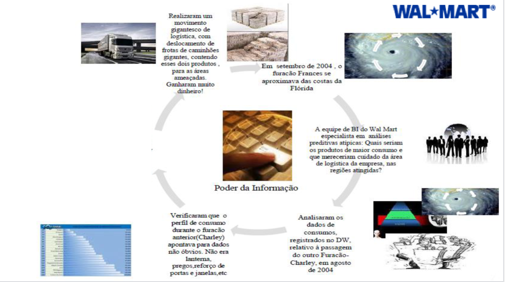

# O que é uma Organização Data-Driven?

## Conceito

Uma **organização data-driven** é aquela que baseia suas decisões e estratégias em dados concretos e análises estruturadas, utilizando informações de forma sistemática para guiar ações.

Embora muitas empresas associadas a esse conceito sejam nativas digitais — como Google, Amazon, Facebook e LinkedIn —, o modelo não se limita ao universo da internet. O **Walmart** é um exemplo pioneiro, utilizando dados como vantagem competitiva desde a década de 1970.

---

## O Caso Walmart: Pioneirismo no Uso de Dados

### Primeiros Passos (Anos 1970-1980)

- Foi uma das primeiras empresas a **construir grandes Data Warehouses** para gerenciar seu inventário.
- Esse investimento permitiu alcançar **US$ 1 bilhão em vendas em apenas 17 anos** de operação.
- Na década de 1980, percebeu que a qualidade dos dados era insuficiente e investiu na **adoção pioneira de leitores de código de barras** nos caixas.

### Objetivos Estratégicos

- Identificar **quais produtos estavam sendo vendidos** e **como sua localização nas lojas impactava as vendas**.
- Compreender **tendências sazonais** e **diferenças regionais** no comportamento do consumidor.
- Gerenciar com precisão o estoque à medida que a rede e o volume de mercadorias cresciam.

### Resultados

- Com dados históricos aliados a modelos preditivos rápidos, conseguiu **otimizar a curva de crescimento** e manter eficiência logística mesmo em larga escala.

---

## Investimentos e Estrutura Tecnológica

- **Grande investimento em Tecnologia da Informação** desde 1988.
- **Maior banco de dados corporativo do mundo**, gerando também o maior **Data Warehouse** corporativo global.
- Capacidade **30 vezes superior ao conteúdo da Biblioteca do Congresso dos EUA**.
- Volume de dados na casa dos **terabytes e petabytes** (DW do Walmart: **600 TB a 1 PB**, em plataforma Teradata).
- Base de dados capaz de gerar **informações gerenciais de alto valor**, incluindo:
    - Perfis detalhados de consumidores (ex.: Sam’s Club).
    - Identificação de dias mais propícios para compra de produto X por consumidor tipo Y.
- Investimento acumulado de mais de **US$ 3 bilhões** desde 1988, sendo **US$ 400 milhões apenas em 2002**.

---

## Exemplo Real: Furacão Frances (2004)

Em setembro de 2004, quando o furacão Frances se aproximava da Flórida:

1. A equipe de BI do Walmart analisou dados de consumo de um furacão anterior (Charley).
2. Identificou padrões não óbvios de compra, como aumento na demanda por lanternas, pregos e reforço de portas e janelas, mas também produtos inesperados.
3. Antecipou a demanda e deslocou grandes frotas de caminhões com estoques desses itens para as áreas ameaçadas.
4. Resultado: **vendas maximizadas e atendimento rápido às necessidades dos clientes**.

---
