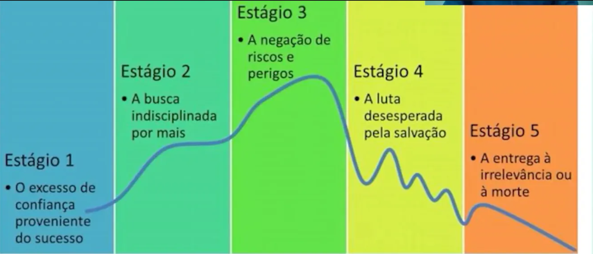
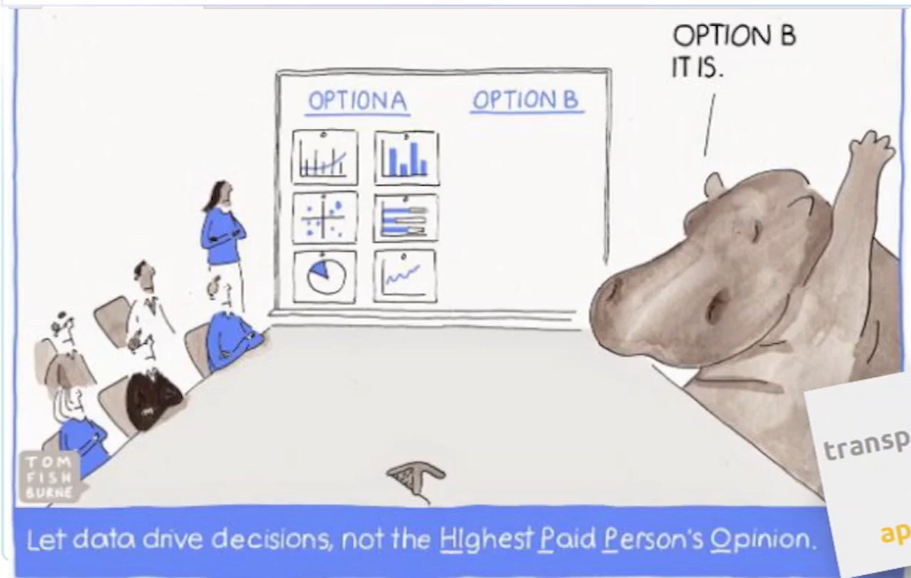

O livro **“Como as Gigantes Caem”** apresenta os **5 estágios do declínio**, destacando a importância de analisar continuamente o mercado para evitar a estagnação.

Outro fator crítico é a **falta de colaboração em equipe**.  
Quando não há uma delegação clara de atividades, a sobrecarga se torna inevitável.  
Nesse cenário, as decisões tendem a ser tomadas com base no *feeling*, em vez de serem fundamentadas em análises de dados concretas.

> Uma empresa orientada a dados **adquire, processa e utiliza dados em tempo hábil**  
> para criar eficiência, iterar e desenvolver novos produtos,  
> e navegar no cenário competitivo.  
>
> — DJ Patil (*Building Data Science Teams*)

---
## ***Como criar essa cultura?***

As organizações orientadas a dados se destacam por manter, de forma incansável, a **qualidade e a integridade de seus dados**.

### Os dados devem ser

- Organizados  
- Bem documentados  
- Livres de erros  

A **limpeza de dados** costuma ser a etapa mais trabalhosa e desgastante.  
Empresas bem-sucedidas investem continuamente em **ferramentas, processos e auditorias regulares** para assegurar a confiabilidade das informações.

Uma das distinções mais relevantes entre organizações orientadas a dados e aquelas que não seguem esse modelo está na forma como abordam a formulação de hipóteses e a resolução de problemas.

Todas as organizações orientadas a dados seguem alguma variante do que chamamos de **método científico de dados**:  
- Parta dos dados;  
- Desenvolva intuições sobre os dados e as perguntas que eles podem responder;  
- Utilize as informações disponíveis para avaliar se a pergunta formulada é de fato a correta;  
- Caso não seja, refine a questão até chegar a uma hipótese testável.  

### Dicas — Tempo

- Configure alertas, por exemplo, por e-mail, para ser notificado em caso de alterações relevantes nos dados.  
- Verifique se os gráficos utilizados, como gráficos de pizza, permitem identificar mudanças de forma clara.  
- Em vez de utilizar um único painel, crie diferentes **dashboards** que representem múltiplas escalas de tempo — por exemplo, alguns em escala horária e outros em escala trimestral.  
- Atenção ao excesso de alarmes: quando ocorrem com muita frequência ou sem relevância, podem gerar **fadiga de alertas**, tornando a equipe insensível às notificações.  

### Dicas — Valor

- **Gerencie seus painéis, não permita que eles gerenciem você.** Revise-os periodicamente e questione se ainda entregam valor. Caso contrário, ajuste-os.  
- É comum que as pessoas considerem seus dashboards como algo fixo e imutável. Na realidade, eles são **entidades vivas**, que devem evoluir junto com a organização.  
- À medida que a maturidade em dados cresce, métricas antigas podem se tornar simplistas. Substitua-as por indicadores mais sofisticados e alinhados às novas necessidades.  

### Dicas — Visual e Histórias

- Os dashboards devem ser **visualmente atraentes**, de modo a prender a atenção dos usuários.  
- Estruture-os de acordo com a **história que precisam transmitir**, destacando as informações que guiam a tomada de decisão.  

---

# Use Case - Twitter (2009)

Em 2009, o **Twitter** enfrentou um grande desafio. Apesar da empolgação inicial com o serviço, **três em cada quatro pessoas abandonavam a plataforma em até dois meses**. Para resolver esse problema de engajamento, a empresa recorreu ao **método científico de dados**, analisando padrões de uso e testando hipóteses.

## Principais Descobertas

1. **Uso inicial recorrente**  
   Usuários que usavam o serviço pelo menos **sete vezes no primeiro mês** tinham mais de **90% de chance de permanecer ativos** nos meses seguintes.

2. **Número mágico de conexões**  
   Usuários que passaram a seguir **30 ou mais contas** tinham uma probabilidade muito maior de se tornarem usuários de longo prazo.

3. **Natureza das conexões importa**  
   Dois terços dos novos usuários seguiam contas por interesse em conteúdo; um terço seguia para obter reciprocidade (follow back). Essa diferença influenciava diretamente a retenção.

## Solução de Integração

A equipe do Twitter contrariou o pensamento convencional da época (seguido por Facebook e LinkedIn) e não forçou o usuário a importar contatos de e-mail.  
Em vez disso, o Twitter implementou:

- **Explicação clara do que é um tweet**.  
- **Sugestão de contas de alta qualidade** segmentadas por categoria (esportes, notícias, etc.).  
- **Recomendações personalizadas** de pessoas com alta probabilidade de interação futura.  

## Resultados

- **+30%** no número de novos usuários completando a experiência inicial.  
- **+20%** no engajamento de longo prazo.  
- Processo de análise e testes levou cerca de **2,5 anos** para alcançar esses resultados.  
- O aprendizado reforçou a necessidade de **testes contínuos e evolução da integração de novos usuários**.  

## Conclusão

O **use case do Twitter em 2009** mostra como uma empresa pode usar dados para:  
- Descobrir padrões críticos de retenção.  
- Testar hipóteses com base no comportamento real dos usuários.  
- Reformular a experiência de integração e engajamento.  

Esse exemplo se tornou um **case clássico de aplicação do método científico de dados em produto digital**, ilustrando que a retenção de usuários depende não apenas da aquisição, mas da forma como eles são integrados e estimulados nos primeiros contatos com a plataforma.

---