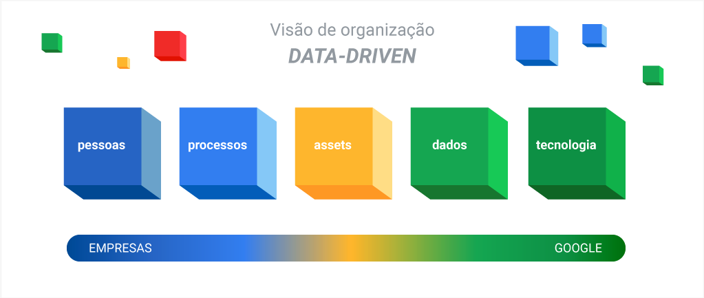

# Data Discovery e Analytics: Desvendando o Poder dos Dados! 

Bem-vindo(a) ao módulo de Data Discovery e Analytics! Prepare-se para uma jornada épica no mundo Data-Driven. Neste conteúdo, vamos explorar como os dados podem transformar a maneira como tomamos decisões, com exemplos práticos e insights inovadores.

---

##  Sumário do Conteúdo

Aqui você encontrará todos os materiais de estudo organizados para facilitar sua jornada de aprendizado.

### Módulo 1: A Cultura Data-Driven

*   **[Aula 1: Introdução ao Universo Data-Drive](./Aula%201%20-%20Introdução%20Data-Drive.md)**
    *   *O que significa ser orientado a dados e por que isso é a maior revolução no mundo dos negócios.*

*   **[Aula 1.1: Anatomia de uma Organização Data-Drive](./Aula%201.1%20-%20Organização%20Data-Drive.md)**
    *   *Explore os pilares, processos e a mentalidade que definem as empresas que prosperam na era dos dados.*

*   **[Aula 1.2: O Conto das Organizações Não Data-Drive](./Aula%201.2%20-%20Organização%20Não%20Data-Drive.md)**
    *   *Uma análise dos desafios e armadilhas enfrentados por organizações que ainda se baseiam na intuição.*

*   **[Aula 1.3: O Interrogatório - Perguntas Essenciais](./Aula%201.3%20-%20Perguntas%20de%20Organizações%20-%20Data%20Driven%20vs%20Não%20Data%20Driven.md)**
    *   *Questões práticas para diagnosticar se uma organização é verdadeiramente orientada a dados ou apenas finge ser.*

---
