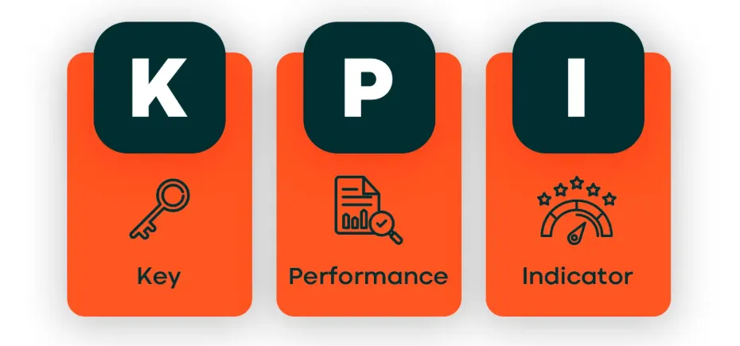
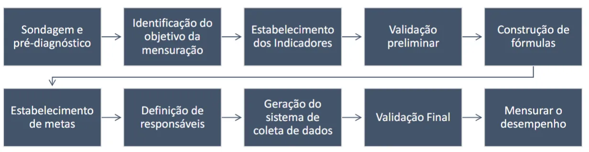

## O que é KPI:

KPI é a sigla para **Key Performance Indicator**, ou em português, **Indicador-Chave de Desempenho**. Trata-se de uma métrica utilizada para medir o desempenho de uma atividade, processo ou estratégia em relação a objetivos previamente definidos.

## **Para que serve os KPI’s?**

Como o próprio nome sugere, os Indicadores-chave de Desempenho servem para avaliar e medir, de forma objetiva e clara, o desempenho dos objetivos e metas da corporação, de suas equipes e processos internos. Além disso, eles são fundamentais para gerar insights de como prosseguir ou solucionar problemas.

**Dessa forma, os indicadores servem para:

• Mensurar resultados e gerir desempenho;

• Embasar a análise crítica dos resultados obtidos e o processo de tomada de decisão;

• Contribuir para a melhoria contínua dos processos organizacionais;

• Facilitar o planejamento e controle do desempenho;

• Viabilizar análises comparativas entre o desempenho da organização e de outras empresas que atuam em áreas ou ambientes semelhantes.**

---

## Finalidade do KPI

Indicadores permitem o conhecimento sobre a situação que se deseja modificar,
estabelecer as prioridades, escolher os beneficiados, identificar os objetivos e traduzi-los
em metas e, assim, acompanhar com mais efetividade o andamento dos trabalhos, avaliar
os processos, adotar os redirecionamentos necessários e verificar os resultados e os
impactos obtidos. Dessa forma, aumentam as chances de serem tomadas decisões corretas
e de se potencializar o uso dos recursos.
IMPORTANTE: indicadores apontam mas não resolvem problemas!

---

## Quais objetivos minha organização tem que atingir?

### Exemplo:

- Objetivo:
    - Usar os dados do NPS para aumentar o boca a boca do curso

- Métrica:
    - Taxa de resposta do NPS
    - Notas do NPS

- KPIs:
    - 70% de resposta do NPS
    - 100% dos detratores abordados

    Para ter bons
    resultados é preciso
    ter objetivos estratégicos bem definidos...

                                                ...e ter dados organizados e disponíveis.
