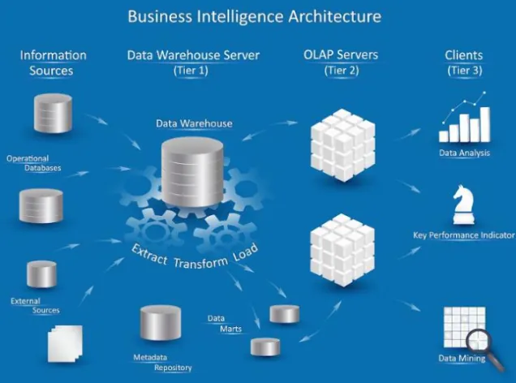

## O que é OLAP:

**OLAP** (Online Analytical Processing) é uma tecnologia voltada para a **análise rápida e multidimensional de grandes volumes de dados**. Ela permite que os usuários explorem informações de forma interativa, realizando comparações, detalhamentos, resumos e cruzamentos de dados com alto desempenho.

**OLAP (Online Analytical Processing)** é uma tecnologia projetada para **realizar análises multidimensionais** de grandes volumes de dados de forma rápida, interativa e estruturada.

> Enquanto bancos de dados transacionais (OLTP) se concentram em registrar operações (compras, cadastros, pagamentos), OLAP organiza os dados históricos e sumarizados para apoiar decisões.
>

## Evolução

##  Arquitetura de um projeto

## Cubo

### O que é um Cubo OLAP?

Um **cubo OLAP** é uma estrutura de dados usada para organizar informações em **múltiplas dimensões** (como tempo, região, produto, cliente, etc.), permitindo **análises rápidas, interativas e flexíveis**.

 | A ideia é que você possa olhar os dados de diferentes “ângulos” — assim como gira um cubo físico.

Um cubo é criado tendo-se em mente o tipo de consulta que um gerente de projeto pode querer fazer. Ao projetar um cubo é importante levar em conta as prováveis consultas que poderão ser feitas no cubo, porém não se deve perder de vista que existem muitas consultas potenciais que podem surgir. Portanto, o projeto de um cubo deve priorizar a escolha e a organização das dimensões que podem influenciar nas medidas relacionadas à decisão que o usuário deve tomar. A escolha das dimensões é fundamental no projeto de um cubo.

---

### OLAP Cubes

---

##  Arquitetura OLAP

---

## Tipos De Drill

---

## Exemplos - PIVOT 

