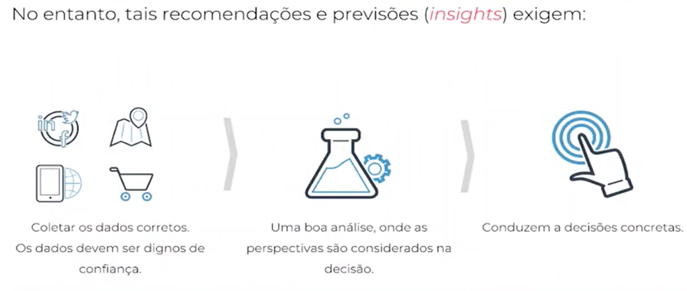
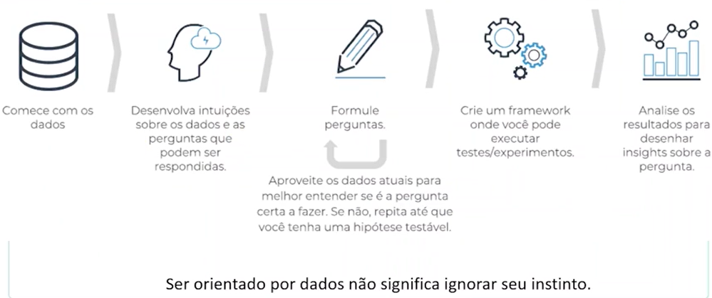

# Qual a diferença entre uma empresa *Data-Driven* e uma **Não Data-Driven**?

## Exemplos de empresas **Não Data-Driven** 

- Quantos itens do produto *X* foram vendidos no **mês passado**?  
- Como foram as vendas por região no Natal do **ano passado**?  
- Quantas unidades do produto *X* foram devolvidas **no mês passado**?  
- Qual foi a receita e o lucro da empresa no **último trimestre**?  
- Quantos empregados foram contratados no **último ano**?  

## Exemplos de empresas **Data-Driven**

- Quantos itens do produto *X* serão vendidos **no próximo mês**?  
- Como serão as vendas por região **no Natal deste ano**?  
- Quantas unidades do produto *X* serão devolvidas no **próximo mês**?  
- Qual será a receita e o lucro da empresa no **próximo trimestre**?  
- Quantos empregados devem ser contratados para **o próximo ano**?  

---

---

##### Exemplos de Empresas Data-Drive:

- Netflix
- Coca-Cola
- Disney
- Amazon